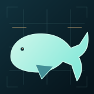

<p align="center">
  
</p>

# Coexisting with Whales

Interactive atlas of sampled cetacean observations, ports and shipping in Norwegian and surrounding waters. Animated diagrams explain an illustrative large whale injury model conditioned on a collision. It does not estimate local encounter or collision probability.

**Live demo**: https://coexisting-with-whales.no/

The GitHub Pages URL https://almazermilov.github.io/coexisting-with-whales/ redirects to the canonical domain above.

A sister project to [Coexisting with Birds](https://coexisting-with-birds.no/), inspired in part by the [HUB Ocean](https://www.hubocean.earth/) initiative and the Mesh Oslo "what else can you build" prompt.

## Quick start

```bash
npm run serve
# open http://localhost:8081
```

No build step. Static files served from any HTTP server. Leaflet and Leaflet.heat are vendored locally. OpenStreetMap tiles and the optional EMODnet WMS need no API keys.

### Running tests

```bash
npm install
npx playwright install chromium
npm test                 # vitest unit + playwright e2e
npm run test:unit
npm run test:e2e
```

## Features

- **Heatmap view**: cetacean observation density across the Norwegian Sea, Barents Sea, North Sea and Greenland Sea using a perceptually uniform ocean palette.
- **Points view**: individual observations colored by species; click a point for details (red list status, common names, source dataset).
- **Species filter**: 21 observed cetacean species (25 reference profiles), with quick filters for great whales, threatened species, red-list species and high strike risk species.
- **Month slider**: filter the historical sample by month. Monthly acquisition quotas prevent interpreting these counts as seasonal abundance.
- **Major ports**: 25 Norwegian ports rendered with risk-coloured markers (icon size scales with annual cargo throughput).
- **Sea regions**: click a sea region to open a per region calculator with a vessel speed slider that updates strike lethality live.
- **Per port collision calculator**: click any port for a Vanderlaan and Taggart 2007 lethality curve, the list of vulnerable species nearby and the moderated risk score.
- **EMODnet vessel density overlay**: 1 km resolution shipping density grid from EMODnet Human Activities, togglable via a single checkbox (no API key, no auth).
- **Sea region density layer**: each region coloured by observation count to show data confidence.
- **Methods and sources**: the indexable about page retains citations and DOI hyperlinks (Vanderlaan and Taggart 2007, Conn and Silber 2013, Rockwood et al. 2017, Williams and O'Hara 2010, Redfern et al. 2013, Laist et al. 2001, Nisi et al. 2024 and more).
- **Light and dark themes**: switch between ocean night mode and a daylight chart style; the map basemap changes with the interface theme.
- **Hide UI**: toggle all overlays with a button or the [H] key for a clean map view.

## Datasets

### Cetacean observations

- **Source**: [GBIF](https://www.gbif.org/) (Global Biodiversity Information Facility)
- **API**: `https://api.gbif.org/v1/occurrence/search`
- **Scope**: order Cetacea (taxonKey 733), bounding box lat 56-82, lon -10 to 70
- **Sample**: 10,000 records out of approximately 138,000 in the bounding box
- **Filter**: excludes MACHINE_OBSERVATION (acoustic hydrophone clusters that distort the heatmap)
- **License**: CC BY 4.0, CC0 1.0 or CC BY-NC 4.0 (per contributing dataset)
- **Citation**: GBIF.org GBIF Occurrence Search for order Cetacea, Norwegian and surrounding waters

### Sea regions

- **Source**: [Marine Regions](https://www.marineregions.org/) IHO Sea Areas v3 (DOI 10.14284/323) via VLIZ WFS
- **Scope**: Norwegian Sea, Barents Sea, North Sea, Greenland Sea
- **License**: CC BY 4.0

### Norwegian EEZ

- **Source**: Marine Regions Maritime Boundaries Geodatabase v12 (DOI 10.14284/632)
- **Scope**: Norway mainland (MRGID 5686), Jan Mayen (8437), Svalbard (33181)
- **License**: CC BY 4.0

### Coastline

- **Source**: [Natural Earth](https://www.naturalearthdata.com/) 50m physical vectors
- **License**: public domain

### Major ports

- **Source**: hand curated from Wikipedia "List of ports in Norway" and Kystverket
- **Coverage**: 25 ports including Oslo, Bergen, Stavanger, Trondheim, Tromso, Bodo, Hammerfest, Kirkenes, Mongstad, Karsto, Sture and others
- **Fields**: name, latitude, longitude, type, approximate annual throughput in million tonnes

### Vessel density (live overlay)

- **Source**: [EMODnet Human Activities](https://emodnet.ec.europa.eu/en/human-activities) Vessel Density Maps
- **API**: WMS at `https://ows.emodnet-humanactivities.eu/wms`, layer `vesseldensity_allavg`
- **Scope**: 1 km grid covering all EU waters and neighbouring areas (2017 to 2024 annual average, all vessel types)
- **License**: EMODnet open with attribution to CLS, ORBCOMM and vesseltracker.com as AIS data providers

### Conservation status

- **Norwegian Red List 2021**: [Artsdatabanken](https://artsdatabanken.no/lister/rodlisteforarter/2021), with verified entries for beluga (EN), bowhead (EN), narwhal (VU), blue whale (EN), fin whale (LC nationally despite VU globally), harbour porpoise (LC), killer whale (LC), sperm whale (NA, since reproduction does not occur in Norwegian waters)
- **Global IUCN Red List**: [IUCN](https://www.iucnredlist.org/), used as a fallback when the Norwegian assessment is NA
- **OSPAR list of threatened and declining species**: bowhead, North Atlantic right whale, blue whale, harbour porpoise

### Collision risk literature

The screening score uses peer reviewed formulas. The full bibliography is rendered inline in the info modal with DOI hyperlinks. Headline references:

- Vanderlaan and Taggart (2007). Vessel collisions with whales: the probability of lethal injury based on vessel speed. *Marine Mammal Science* 23(1), 144 to 156. doi:10.1111/j.1748-7692.2006.00098.x
- Conn and Silber (2013). Vessel speed restrictions reduce risk of collision related mortality for North Atlantic right whales. *Ecosphere* 4(4), art. 43. doi:10.1890/ES13-00004.1
- Rockwood, Calambokidis and Jahncke (2017). High mortality of blue, humpback and fin whales from modeling of vessel collisions on the U.S. West Coast. *PLOS ONE* 12(8), e0183052. doi:10.1371/journal.pone.0183052
- Williams and O'Hara (2010). Modelling ship strike risk to fin, humpback and killer whales in British Columbia. *J. Cetacean Res. Manage.* 11(1), 1 to 8.
- Redfern et al. (2013). Assessing the risk of ships striking large whales in marine spatial planning. *Conservation Biology* 27(2), 292 to 302. doi:10.1111/cobi.12029
- Laist et al. (2001). Collisions between ships and whales. *Marine Mammal Science* 17(1), 35 to 75.
- Nisi et al. (2024). Ship collision risk threatens whales across the world's oceans. *Science* 385, 1136 to 1141. doi:10.1126/science.adp1950

## Refreshing data

```bash
python3 fetch_data.py             # GBIF cetacean observations (~1 min)
python3 scripts/fetch_geo.py      # Sea regions, EEZ, coastline, ports (~30 sec)
```

`fetch_data.py` stratifies across months to balance the strong summer skew. Adjust `limit_total` to change the sample size; 10K records is roughly 1.7 MB. The hard pagination ceiling on the GBIF search API is 100K offset; for larger samples use the asynchronous Occurrence Download API.

`scripts/fetch_geo.py` requires `mapshaper` (npm install -g mapshaper) for simplification. Without it the geographic files will be much larger.

## File structure

```
index.html                Main HTML with metadata, side panel, modals, legend
css/style.css             Styles with CSS custom properties (ocean palette)
js/data.js                Constants: species, IUCN, Norwegian Red List 2021, seasonality
js/refs.js                Literature references with DOI links and tooltip helpers
js/scoring.js             Pure functions: injury curve and illustrative scoring
js/ui.js                  DOM updates: filters, species list, toggles
js/app.js                 Entry point: map init, data loading, events
data/whales_norway.json   10K cetacean observations from GBIF
data/sea_regions.geojson  Norwegian, Barents, North, Greenland Sea (IHO v3)
data/coastline.geojson    Natural Earth 50m, clipped to Norway bbox
data/eez.geojson          Norwegian EEZ (mainland + Jan Mayen + Svalbard)
data/ports.json           25 major Norwegian ports (hand curated)
fetch_data.py             GBIF cetacean fetcher
scripts/fetch_geo.py      Geographic data fetcher with mapshaper simplification
tests/unit/*.test.js      Vitest unit tests (64 tests, scoring + filters)
tests/e2e/app.spec.js     Playwright end to end tests
```

## Limitations

This is a screening tool, not an environmental impact assessment.

- Cetacean records reflect observer effort, not true density. Coastal viewpoints (Andoya, Lofoten, Tromso) and tourist boat routes are overrepresented.
- EMODnet's vessel density grid is a 2017 to 2024 annual average, not real time.
- Norway specific peer reviewed strike risk modelling is sparse. We apply a published large whale injury curve (Vanderlaan and Taggart 2007) to a global set of species accounts. For real planning use site specific surveys, Kystverket / BarentsWatch live AIS, and modelled species distributions from Havforskningsinstituttet.
- The North Atlantic right whale (CR) is included for completeness but is functionally absent from the NE Atlantic.

## Deployment

Hosted on GitHub Pages, free. Deployment is automated via `.github/workflows/deploy.yml` on every push to `main`. Tests run via `.github/workflows/test.yml`. No external dependencies (no Vercel, no AWS, no API keys).

## License

MIT, see [LICENSE](LICENSE). All data is from open sources with attribution preserved.

## Author

Built by [Almaz Ermilov](https://www.linkedin.com/in/almazermilov/) in Oslo, April 2026.

## Marine diagrams and offline use

The fullscreen Ocean intro replays at any time, with keyboard dismissal and reduced motion support. Port and sea region diagrams compare the chosen vessel speed with 10 knots. Species cards include 15 licensed local photos, 15 sourced facts, sample counts and monthly histograms. Missing photos use an explicitly labelled generic illustration. Credits are in [docs/whale-images.md](docs/whale-images.md).

The GitHub Pages deployment needs no database or API credentials. A service worker saves an atomic versioned application snapshot after a successful first online visit. It includes local records, coastline, place names, scripts and fonts, with optional photos. It never caches third party tiles. Browser storage can be unavailable or evicted; the first visit still needs a connection. Snapshot date means the date saved to that browser, not the age of observations. The bundled 9,996 records were committed in April 2026 and have no verified retrieval timestamp.

Run `npm run snapshot` after changing public assets. Commit the generated worker with the changes. CI checks its content hash. Existing visitors receive a refresh button when an update is ready. GitHub Pages publishes only the public website files.
